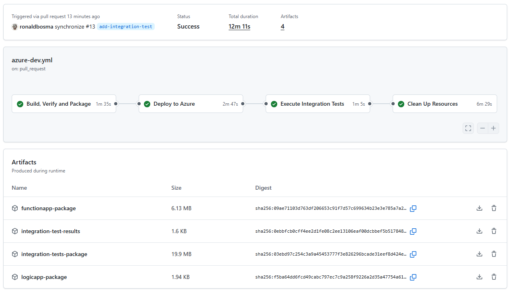
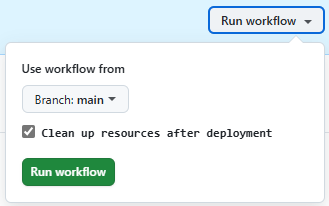

# Azure Integration Services Quickstart

An `azd` template (Bicep) for quickly deploying Azure Integration Services, including **Azure API Management**, **Function App**, **Logic App**, **Service Bus** and **Event Hubs namespace**, along with supporting resources such as **Application Insights**, **Key Vault** and **Storage Account**. This template is ideal for demos, testing or getting started with Azure Integration Services.

## Overview

This template deploys the following resources:


This template is designed to simplify and accelerate the deployment of Azure Integration Services for:

- Demos  
- Testing configurations  
- Quick setups for experimentation  
- CI scenarios in your pipeline  

To minimize cost and reduce deployment time, the cheapest possible SKUs are used for each service. Virtual networks, application gateways and other security measures typically implemented in production scenarios are not included. Keep in mind that some resources may still incur costs, so it's a good idea to clean up when you're finished to avoid unexpected charges. The estimated costs are between $6 and $7 per day.

> [!IMPORTANT]  
> This template is not production-ready; it uses minimal cost SKUs and omits network isolation, advanced security, governance and resiliency. Harden security, implement enterprise controls and/or replace modules with [Azure Verified Modules](https://azure.github.io/Azure-Verified-Modules/) before any production use.

A sample application is included in the template to demonstrate how the services can be used together. It consists of an API that allows a message to be published to a Service Bus topic. A function and a workflow are triggered by the message. The function stores the message in table storage, while the workflow stores the message in blob storage. Using the API, stored messages can be retrieved. See the following diagram for an overview:


## Getting Started

### Prerequisites  

Before you can deploy this template, make sure you have the following tools installed and the necessary permissions. 

**Required Tools:**
- [Azure Developer CLI (azd)](https://learn.microsoft.com/en-us/azure/developer/azure-developer-cli/install-azd)  
  - Installing `azd` also installs the following tools:  
    - [GitHub CLI](https://cli.github.com)  
    - [Bicep CLI](https://learn.microsoft.com/en-us/azure/azure-resource-manager/bicep/install)  
- [.NET Core 9 SDK](https://dotnet.microsoft.com/en-us/download/dotnet/9.0)  
- [npm CLI](https://nodejs.org/) _(This template uses a workaround to deploy the Logic App workflow, which requires the npm CLI.)_

**Required Permissions:**
- You need **Owner** permissions, or a combination of **Contributor** and **Role Based Access Control Administrator** permissions on an Azure Subscription to deploy this template.

#### Optional Prerequisites

This templates uses a hook to permanently delete the Log Analytics Workspace. If you do not have the following tools installed, remove the hook from [azure.yaml](azure.yaml). See [this section](#hooks) for more information.

- [PowerShell](https://learn.microsoft.com/en-us/powershell/scripting/install/installing-powershell)
- [Azure CLI](https://learn.microsoft.com/en-us/cli/azure/install-azure-cli?view=azure-cli-latest)

### Deployment

Once the prerequisites are installed on your machine, you can deploy this template using the following steps:

1. Run the `azd init` command in an empty directory with the `--template` parameter to clone this template into the current directory.  

    ```cmd
    azd init --template ronaldbosma/azure-integration-services-quickstart
    ```

    When prompted, specify the name of the environment, for example, `aisquick`. The maximum length is 32 characters.

1. Run the `azd auth login` command to authenticate to your Azure subscription using the **Azure Developer CLI** _(if you haven't already)_.

    ```cmd
    azd auth login
    ```

1. Run the `az login` command to authenticate to your Azure subscription using the **Azure CLI** _(if you haven't already)_. This is required for the [hooks](#hooks) to function properly. Make sure to log into the same tenant as the Azure Developer CLI.

    ```cmd
    az login
    ```

1. Run the `azd up` command to provision the resources in your Azure subscription. This will deploy both the infrastructure and the sample application, and typically takes around 5 minutes to complete. _(Use `azd provision` to only deploy the infrastructure.)_

    ```cmd
    azd up
    ```

    You'll be prompted to select the Azure Integration Services to include in the deployment. For each service, use the arrow keys to select `True` to include it or `False` to skip it, then press `Enter` to continue.  

    The `includeApplicationInfraResources` parameter specifies whether the application infrastructure resources defined in Bicep should be deployed. These resources are used by the sample application and include the Sample API in API Management, topics and subscriptions in Azure Service Bus, as well as tables and containers in Azure Storage.  

    

    See [Troubleshooting](#troubleshooting) if you encounter any issues during deployment.

1. Once the deployment is complete, you can locally modify the application or infrastructure and run `azd up` again to update the resources in Azure.

If you only deploy the Function App or Logic App, use `azd provision` to deploy the infrastructure and then use `azd deploy functionApp` or `azd deploy logicApp` to deploy the sample Azure Function or Logic App workflow, respectively.

### Test

The [tests.http](./tests/tests.http) file contains a set of HTTP requests that you can use to test the deployed resources. Note that you'll need to deploy the application infrastructure, API Management and Service Bus, and include the Function and/or Logic App.

Follow these steps to test the sample application using Visual Studio Code:

1. Install the [REST Client](https://marketplace.visualstudio.com/items?itemName=humao.rest-client) extension in Visual Studio Code. 
1. The API is protected and needs to be called with a subscription key. Either:
   - Locate the `Built-in all-access` subscription in API Management and copy the primary key,
   - Or locate the `apim-master-subscription-key` secret in Key Vault and copy the secret value.
1. Add an environment to your Visual Studio Code user settings with the API Management hostname and subscription key. Use the following example and replace the values with your own:
   ```
   "rest-client.environmentVariables": {
       "aisquick": {
           "apimHostname": "apim-aisquick-sdc-5spzh.azure-api.net",
           "apimSubscriptionKey": "1234567890abcdefghijklmnopqrstuv"
       }
   }
   ```
1. Open `tests.http` and at the bottom right of the editor, select the `aisquick` environment you just configured.
1. Click on `Send Request` above the first request. This will send a message to the Service Bus topic.
1. Click on `Send Request` above the second request to retrieve the message from the storage table. A `404 Not Found` response might be returned if the message hasn't been processed yet or if you haven't deployed the Azure Function.
1. Click on `Send Request` above the third request to retrieve the message from the blob container. A `404 Not Found` response might be returned if the message hasn't been processed yet or if you haven't deployed the Logic App workflow.

### Demo

See the [Demo Guide](demos/demo-sample-application.md) for a step-by-step walkthrough on how to demonstrate the deployed resources and the sample application.

### Clean up

Once you're done and want to clean up, run the `azd down` command. By including the `--purge` parameter, you ensure that the API Management service doesn't remain in a soft-deleted state, which could block future deployments of the same environment.

```cmd
azd down --purge
```

### Changing which resources are deployed

There are a couple of ways to change which Azure Integration Services are deployed and whether the application infrastructure resources should be deployed.

1. Remove your environment folder from the `.azure` folder. After deletion, use `azd init` to reinitialize the environment (with the same name). You'll be prompted again to select which services to deploy when running `azd up` or `azd provision`.

1. If the environment is currently deployed, locate the file `.azure/<environment-name>/.env` and change the values of the `INCLUDE_*` variables to `true` or `false`.

   For example, to deploy API Management and the Function App, but not the Logic App, Service Bus and Event Hubs namespace, use the following settings:

   ```
   ...TRUNCATED...
   INCLUDE_API_MANAGEMENT="true"
   INCLUDE_APPLICATION_INFRA_RESOURCES="false"
   INCLUDE_EVENT_HUBS_NAMESPACE="false"
   INCLUDE_FUNCTION_APP="true"
   INCLUDE_LOGIC_APP="false"
   INCLUDE_SERVICE_BUS="false"
   ```

1. If the environment has been taken down, most variables in the `.env` file are removed. Instead, locate the `.azure/<environment-name>/config.json` file and change the values of the parameters to `true` or `false`.

   For example, to deploy API Management and the Function App, but not the Logic App, Service Bus and Event Hubs namespace, use the following settings:

   ```json
   {
     "infra": {
       "parameters": {
         "includeApiManagement": true,
         "includeApplicationInfraResources": false,
         "includeEventHubsNamespace": false,
         "includeFunctionApp": true,
         "includeLogicApp": false,
         "includeServiceBus": false
       }
     }
   }
   ```

   The environment variables take precedence over the parameters in the `config.json` file. If both are present, the environment variables will be used.

When disabling an already deployed service, it will not be removed when running `azd up` or `azd provision` again. You will need to manually remove the resources from the Azure portal or use `azd down` to remove the entire environment.

## Contents

The repository consists of the following files and directories:

```
├── demos                      [ Demo guide(s) ]
├── hooks                      [ AZD Hooks to execute at different stages of the deployment process ]
├── images                     [ Images used in the README ]
├── infra                      [ Infrastructure As Code files ]
│   |── functions              [ Bicep user-defined functions ]
│   ├── modules                
│   │   ├── application        [ Modules for application infrastructure resources ]
│   │   ├── services           [ Modules for all Azure services ]
│   │   └── shared             [ Reusable modules ]
│   ├── types                  [ Bicep user-defined types ]
│   ├── main.bicep             [ Main infrastructure file ]
│   └── main.parameters.json   [ Parameters file ]
├── src                        [ Application code ]
│   ├── functionApp            [ Azure Functions ]
│   └── logicApp               [ Logic App workflow]
├── tests                      
│   └── tests.http             [ HTTP requests to test the deployed resources ]
├── azure.yaml                 [ Describes the apps and types of Azure resources ]
└── bicepconfig.json           [ Bicep configuration file ]
```


## Template Breakdown

As mentioned in the [Overview](#overview) section, this template deploys a set of Azure Integration Services along with supporting resources. The following sections provide a detailed description of the resources that are deployed and how they are connected.

### Infrastructure

#### API Management

When the `includeApiManagement` parameter or the corresponding `INCLUDE_API_MANAGEMENT` environment variable is set to `true`, a Consumption tier API Management service is deployed via the [api-management.bicep](./infra/modules/services/api-management.bicep) module:

- Both a user-assigned managed identity and system-assigned managed identity are deployed to provide access to other services. See the [Role Assignments](#role-assignments) section for more information.
- The primary key of the default `master` subscription is stored in a Key Vault secret called `apim-master-subscription-key`. This key can be used, for example, by the Function App to access APIs hosted on API Management.
- The deployment also includes backends for the Service Bus (\*), various Storage Account endpoints and the Event Hubs namespace (\*).  
  _Note: The `*` indicates that the backend is only deployed if the corresponding service is included._


#### Function App

When the `includeFunctionApp` parameter or the corresponding `INCLUDE_FUNCTION_APP` environment variable is set to `true`, a Function App is deployed via the [function-app.bicep](./infra/modules/services/function-app.bicep) module:

- The `Y1` (Consumption) pricing tier is used. 
- The worker runtime is configured to .NET 9 isolated. 
- Both a user-assigned managed identity and system-assigned managed identity are deployed to provide access to other services. See the [Role Assignments](#role-assignments) section for more information.

The following app settings (environment variables) are configured to facilitate connections to other services.

| Name                                              | Description                                                                                                                |
|---------------------------------------------------|----------------------------------------------------------------------------------------------------------------------------|
| `ApiManagement_gatewayUrl` *                      | The base URL for API Management. For example: `https://apim-aisquick-sdc-5spzh.azure-api.net`.                             |
| `ApiManagement_subscriptionKey` *                 | A Key Vault reference to the subscription key of the default `master` subscription in API Management.                      |
| `StorageAccountConnection__blobServiceUri`        | The Blob Storage endpoint. For example: `https://staisquicksdc5spzh.blob.core.windows.net`.                                |
| `StorageAccountConnection__fileServiceUri`        | The File Storage endpoint. For example: `https://staisquicksdc5spzh.file.core.windows.net`.                                |
| `StorageAccountConnection__queueServiceUri`       | The Queue Storage endpoint. For example: `https://staisquicksdc5spzh.queue.core.windows.net`.                              |
| `StorageAccountConnection__tableServiceUri`       | The Table Storage endpoint. For example: `https://staisquicksdc5spzh.table.core.windows.net`.                              |
| `EventHubConnection__fullyQualifiedNamespace` *   | The fully qualified namespace of the Event Hubs namespace. For example: `evhns-aisquick-sdc-5spzh.servicebus.windows.net`. |
| `ServiceBusConnection__fullyQualifiedNamespace` * | The fully qualified namespace of the Service Bus. For example: `sbns-aisquick-sdc-5spzh.servicebus.windows.net`.           |

_Note: The `*` indicates that the setting is only deployed if the corresponding service is included._

The `StorageAccountConnection`, `EventHubConnection` or `ServiceBusConnection` connection name can be used in triggers and bindings of a function. See [SampleFunction.cs](./src/functionApp/SampleFunction.cs) for an example.

#### Logic App

When the `includeLogicApp` parameter or the corresponding `INCLUDE_LOGIC_APP` environment variable is set to `true`, a Standard single-tenant Logic App is deployed via the [logic-app.bicep](./infra/modules/services/logic-app.bicep) module:

- The `WS1` (Workflow Standard) pricing tier is used. 
- The worker runtime is configured to .NET 9 to enable the use of [custom .NET code](https://learn.microsoft.com/en-us/azure/logic-apps/create-run-custom-code-functions). 
- Both a user-assigned managed identity and system-assigned managed identity are deployed to provide access to other services. See the [Role Assignments](#role-assignments) section for more information.

The following app settings (environment variables) are configured to facilitate connections to other services. These are used in the [connections.json](./src/logicApp/Workflows/connections.json) file of the sample application.

| Name                                   | Description                                                                                                                |
|----------------------------------------|----------------------------------------------------------------------------------------------------------------------------|
| `ApiManagement_gatewayUrl` *           | The base URL for API Management. For example: `https://apim-aisquick-sdc-5spzh.azure-api.net`.                             |
| `ApiManagement_subscriptionKey` *      | A Key Vault reference to the subscription key of the default `master` subscription in API Management.                      |
| `AzureBlob_blobStorageEndpoint`        | The Blob Storage endpoint. For example: `https://staisquicksdc5spzh.blob.core.windows.net`.                                |
| `AzureFile_storageAccountUri`          | The File Storage endpoint. For example: `https://staisquicksdc5spzh.file.core.windows.net`.                                |
| `AzureQueues_queueServiceUri`          | The Queue Storage endpoint. For example: `https://staisquicksdc5spzh.queue.core.windows.net`.                              |
| `AzureTables_tableStorageEndpoint`     | The Table Storage endpoint. For example: `https://staisquicksdc5spzh.table.core.windows.net`.                              |
| `EventHub_fullyQualifiedNamespace` *   | The fully qualified namespace of the Event Hubs namespace. For example: `evhns-aisquick-sdc-5spzh.servicebus.windows.net`. |
| `ServiceBus_fullyQualifiedNamespace` * | The fully qualified namespace of the Service Bus. For example: `sbns-aisquick-sdc-5spzh.servicebus.windows.net`.           |

_Note: The `*` indicates that the setting is only deployed if the corresponding service is included._

#### Service Bus

When the `includeServiceBus` parameter or the corresponding `INCLUDE_SERVICE_BUS` environment variable is set to `true`, a Standard tier Service Bus is deployed via the [service-bus.bicep](./infra/modules/services/service-bus.bicep) module. The Standard tier enables features such as topics and subscriptions, which are used by the sample application.

#### Event Hubs namespace

When the `includeEventHubsNamespace` parameter or the corresponding `INCLUDE_EVENT_HUBS_NAMESPACE` environment variable is set to `true`, a Standard tier Event Hubs namespace is deployed via the [event-hubs-namespace.bicep](./infra/modules/services/event-hubs-namespace.bicep) module. The Standard tier supports multiple consumer groups per hub, enabling publish-subscribe scenarios.

#### Role Assignments

The [assign-roles-to-principal.bicep](./infra/modules/shared/assign-roles-to-principal.bicep) module is used to assign roles to the principal of the deployer and to the user-assigned & system-assigned managed identities of API Management, the Function App and Logic App. These role assignments are:

- Event Hubs namespace roles:
  - Azure Event Hubs Data Receiver
  - Azure Event Hubs Data Sender
- Key Vault roles:
  - Key Vault Administrator _(this role is only assigned to the principal of the deployer)_
  - Key Vault Secrets User _(this role is assigned to the managed identities)_
- Service Bus roles:
  - Azure Service Bus Data Receiver
  - Azure Service Bus Data Sender
- Storage Account roles:
  - Storage Blob Data Contributor
  - Storage File Data Privileged Contributor _(this role is only assigned to the principal of the deployer)_
  - Storage File Data SMB Share Contributor _(this role is assigned to the managed identities)_
  - Storage Queue Data Contributor
  - Storage Table Data Contributor

These roles are assigned to the principals based on the resources that are included in the deployment.

#### Supporting Resources  

In addition to the Azure Integration Services, the template deploys several supporting resources to enhance functionality and monitoring:  

- Application Insights: Provides monitoring, logging and diagnostics.  
- Key Vault: Securely stores secrets and keys, such as API Management subscription keys.  
- Storage Account: Used to deploy Logic App and Function App code and stores data for the sample application.  


### Application

#### Infrastructure

When the `includeApplicationInfraResources` parameter or the corresponding `INCLUDE_APPLICATION_INFRA_RESOURCES` environment variable is set to `true`, the sample application's infrastructure resources are deployed. These resources are defined in the [application.bicep](./infra/modules/application/application.bicep) module:

- An API is deployed in API Management. It allows messages to be published to a Service Bus topic and retrieves data stored in the Storage Account.  
- A topic and subscriptions are created in the Service Bus namespace. Messages published to the topic trigger the Function App and Logic App.
- A storage table and blob container are created in the Storage Account. These are used by the Function App and Logic App to store messages.  

Although these resources are part of the application, they are deployed as part of the infrastructure using `azd up` or `azd provision`. This is necessary because the Azure Developer CLI does not support deploying Bicep resources as part of the application with `azd deploy`.

#### Azure Function  

The [functionApp](./src/functionApp) directory contains the code for the Azure Function deployed to the Function App. The function is triggered by messages sent to the Service Bus topic and stores the message in a table within the Storage Account.  

#### Logic App workflow  

The [logicApp](./src/logicApp) directory contains the Logic App workflow. The workflow is triggered by messages sent to the Service Bus topic and stores the message in a blob container within the Storage Account.  

The sample [connections.json](./src/logicApp/Workflows/connections.json) file includes connections to the various Storage Account services, the Service Bus and the Event Hubs namespace.  


## Naming Convention

All resources are deployed using the following naming convention, which is based on the [Azure Resource Naming Best Practices](https://learn.microsoft.com/en-us/azure/cloud-adoption-framework/ready/azure-best-practices/resource-naming). The workload and environment are combined into a single identifier to better support the `azd` workflow.


This [naming convention](infra/functions/naming-conventions.bicep) is implemented using a variation of the Bicep user-defined functions, as described in the blog post [Apply Azure naming convention using Bicep functions](https://ronaldbosma.github.io/blog/2024/06/05/apply-azure-naming-convention-using-bicep-functions/).

The following image displays an example of the resources deployed with this template:


## Hooks

This template has hooks that are executed at different stages of the deployment process. The following hooks are included:
  
- [predown-remove-law.ps1](hooks/predown-remove-law.ps1): 
  This PowerShell script is executed before the resources are removed. 
  It permanently deletes all Log Analytics workspaces in the resource group to prevent issues with future deployments.
  Sometimes the requests and traces don't show up in Application Insights & Log Analytics when removing and deploying the template multiple times.


## Pipeline

This template includes a GitHub Actions workflow that automates the build, deployment and cleanup process. The workflow is defined in [azure-dev.yml](.github/workflows/azure-dev.yml) and provides a complete CI/CD pipeline for your Azure Integration Services using the Azure Developer CLI.



The pipeline consists of three main jobs:

- **Build, Verify and Package**: This job sets up the build environment, performs Bicep linting and packages the Function App and Logic App applications.
- **Deploy**: This job provisions the Azure infrastructure and deploys the packaged applications to the created resources.
- **Cleanup**: This job removes all deployed Azure resources. By default, cleanup runs automatically after deployment. This can be disabled via an input parameter when the workflow is triggered manually.

  

### Setting Up the Pipeline

To set up the pipeline in your own repository, run the following command:

```cmd
azd pipeline config
```

Follow the instructions and choose either **Federated User Managed Identity (MSI + OIDC)** or **Federated Service Principal (SP + OIDC)** as these are the authentication methods the pipeline expects.

For detailed guidance, refer to:
- [Explore Azure Developer CLI support for CI/CD pipelines](https://learn.microsoft.com/en-us/azure/developer/azure-developer-cli/configure-devops-pipeline)
- [Create a GitHub Actions CI/CD pipeline using the Azure Developer CLI](https://learn.microsoft.com/en-us/azure/developer/azure-developer-cli/pipeline-github-actions)

> [!TIP]
> By default, `AZURE_CLIENT_ID`, `AZURE_TENANT_ID` and `AZURE_SUBSCRIPTION_ID` are created as variables when running `azd pipeline config`. However, [Microsoft recommends](https://learn.microsoft.com/en-us/azure/developer/github/connect-from-azure-openid-connect) using secrets for these values to avoid exposing them in logs. The workflow supports both approaches, so you can manually create secrets and remove the variables if desired.

> [!NOTE]
> The environment name in the `AZURE_ENV_NAME` variable is suffixed with `-pr{id}` for pull requests. This prevents conflicts when multiple PRs are open and avoids accidental removal of environments, because the environment name tag is used for resource removal.


## Troubleshooting

### Failed: Deploying service functionApp

If you're executing `azd up` or `azd deploy`, you may encounter the following error if the Function App was not included in the deployment:

> ERROR: error executing step command 'deploy --all': getting target resource: resource not found: unable to find a resource tagged with 'azd-service-name: functionApp'. Ensure the service resource is correctly tagged in your infrastructure configuration, and rerun provision

Use `azd provision` if you only want to deploy the infrastructure without the application resources. Use `azd deploy logicApp` if you want to deploy the Logic App workflow. See [Changing which resources are deployed](#changing-which-resources-are-deployed) if you want to include the Function App in the deployment.

### Failed: Deploying service logicApp

If you're executing `azd up` or `azd deploy`, you may encounter the following error if the Logic App was not included in the deployment:

> ERROR: error executing step command 'deploy --all': getting target resource: resource not found: unable to find a resource tagged with 'azd-service-name: logicApp'. Ensure the service resource is correctly tagged in your infrastructure configuration, and rerun provision

Use `azd provision` if you only want to deploy the infrastructure without the application resources. Use `azd deploy functionApp` if you want to deploy the Azure Function. See [Changing which resources are deployed](#changing-which-resources-are-deployed) if you want to include the Logic App in the deployment.

### API Management deployment failed because the service already exists in soft-deleted state

If you've previously deployed this template and deleted the resources, you may encounter the following error when redeploying the template. This error occurs because the API Management service is in a soft-deleted state and needs to be purged before you can create a new service with the same name.

```json
{
    "code": "DeploymentFailed",
    "target": "/subscriptions/00000000-0000-0000-0000-000000000000/resourceGroups/rg-aisquick-sdc-5spzh/providers/Microsoft.Resources/deployments/apiManagement",
    "message": "At least one resource deployment operation failed. Please list deployment operations for details. Please see https://aka.ms/arm-deployment-operations for usage details.",
    "details": [
        {
            "code": "ServiceAlreadyExistsInSoftDeletedState",
            "message": "Api service apim-aisquick-sdc-5spzh was soft-deleted. In order to create the new service with the same name, you have to either undelete the service or purge it. See https://aka.ms/apimsoftdelete."
        }
    ]
}
```

Use the [az apim deletedservice list](https://learn.microsoft.com/en-us/cli/azure/apim/deletedservice?view=azure-cli-latest#az-apim-deletedservice-list) Azure CLI command to list all deleted API Management services in your subscription. Locate the service that is in a soft-deleted state and purge it using the [purge](https://learn.microsoft.com/en-us/cli/azure/apim/deletedservice?view=azure-cli-latest#az-apim-deletedservice-purge) command. See the following example:

```cmd
az apim deletedservice purge --location "swedencentral" --service-name "apim-aisquick-sdc-5spzh"
```

### Function App deployment failed because of quota limitations

If you already have a Consumption tier (`SKU=Y1`) Function App deployed in the same region, you may encounter the following error when deploying the template. This error occurs because you have reached the region's quota for your subscription.

```json
{
  "code": "InvalidTemplateDeployment",
  "message": "The template deployment 'functionApp' is not valid according to the validation procedure. The tracking id is '00000000-0000-0000-0000-000000000000'. See inner errors for details.",
  "details": [
    {
      "code": "ValidationForResourceFailed",
      "message": "Validation failed for a resource. Check 'Error.Details[0]' for more information.",
      "details": [
        {
          "code": "SubscriptionIsOverQuotaForSku",
          "message": "This region has quota of 1 instances for your subscription. Try selecting different region or SKU."
        }
      ]
    }
  ]
}
```

Use the `azd down --purge` command to delete the resources, then deploy the template in a different region.

### Logic App deployment failed because of quota limitations

If you already have a Workflow Standard WS1 tier (`SKU=WS1`) Logic App deployed in the same region, you may encounter the following error when deploying the template. This error occurs because you have reached the region's quota for your subscription.

```json
{
  "code": "InvalidTemplateDeployment",
  "message": "The template deployment 'logicApp' is not valid according to the validation procedure. The tracking id is '00000000-0000-0000-0000-000000000000'. See inner errors for details.",
  "details": [
    {
      "code": "ValidationForResourceFailed",
      "message": "Validation failed for a resource. Check 'Error.Details[0]' for more information.",
      "details": [
        {
          "code": "SubscriptionIsOverQuotaForSku",
          "message": "This region has quota of 1 instances for your subscription. Try selecting different region or SKU."
        }
      ]
    }
  ]
}
```

Use the `azd down --purge` command to delete the resources, then deploy the template in a different region.

### Logging doesn't show in App Insights

Sometimes the requests and traces don't show up in Application Insights & Log Analytics. I've had this happen when I'd taken down an environment and redeployed it with the same name. 

To resolve this, first remove the environment using `azd down --purge`. Then, permanently delete the Log Analytics workspace using the [`az monitor log-analytics workspace delete`](https://learn.microsoft.com/en-us/cli/azure/monitor/log-analytics/workspace?view=azure-cli-latest#az-monitor-log-analytics-workspace-delete) command. Here's an example:

```cmd
az monitor log-analytics workspace delete --resource-group rg-aisquick-sdc-5spzh --workspace-name log-aisquick-sdc-5spzh --force
```

After that, redeploy the template. If logging still doesn't appear, deploy the template in a different region or using a different environment name.

I've registered https://github.com/Azure/azure-dev/issues/5080 in the Azure Developer CLI repository to track this issue.

### ERROR: prompting for value: default value of select must be an int or string

You may see this error when running `azd up` or `azd provision` from Azure Cloud Shell:

```
ERROR: prompting for value: default value of select must be an int or string
```

This template uses optional boolean parameters to include or exclude resources, which doesn't seem to work in the Cloud Shell. 

Workarounds:
1. Run the command from another environment, like your local machine.
1. Pre-set the environment variables so no interactive prompts are required, then run `azd up` or `azd provision` again.

   For example, to deploy API Management and the Function App, but not the Logic App, Service Bus and Event Hubs namespace, execute the following commands:

    ```cmd
    azd env set INCLUDE_API_MANAGEMENT true
    azd env set INCLUDE_APPLICATION_INFRA_RESOURCES false
    azd env set INCLUDE_EVENT_HUBS_NAMESPACE false
    azd env set INCLUDE_FUNCTION_APP true
    azd env set INCLUDE_LOGIC_APP false
    azd env set INCLUDE_SERVICE_BUS false
    ```

I've registered [this issue](https://github.com/Azure/azure-dev/issues/5944) in the Azure Developer CLI repository to track this problem.
